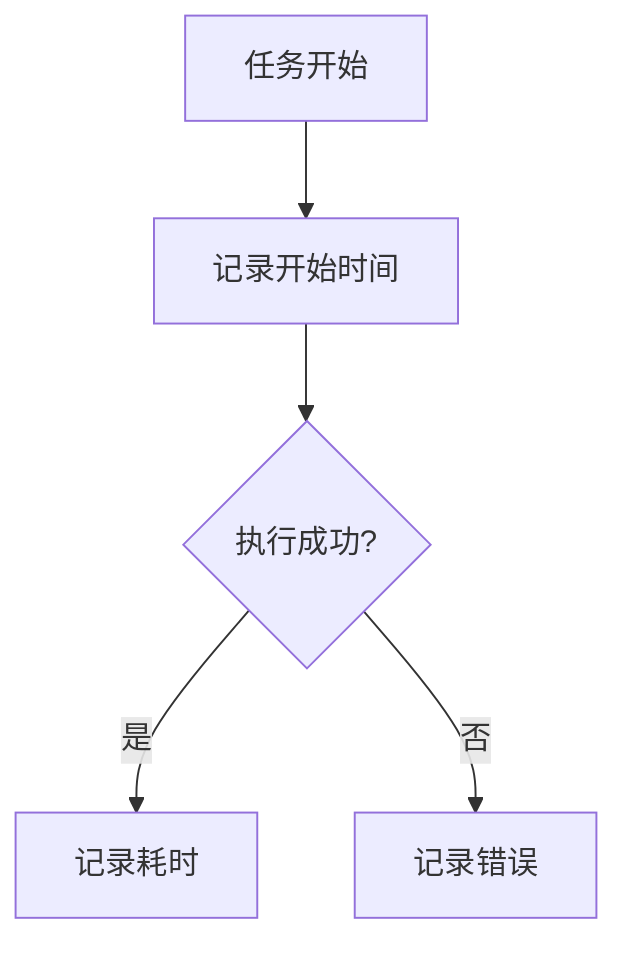

# 开发者指南

## 监控指标开发规范

### 默认配置
- 监控端口: `8000`
- 指标路径: `/metrics`

### 1. 添加新指标
```python
from src.utils.metrics import TaskMetrics

class MyService:
    def __init__(self):
        self.metrics = TaskMetrics()
        
    def my_task(self):
        with self.metrics.track_task('my_task'):
            # 任务逻辑
            pass
```

### 2. 指标命名规则
- 计数器: `_total`后缀 (例: `errors_total`)
- 直方图: `_seconds`后缀 (例: `duration_seconds`)
- 标签: 小写+下划线 (例: `task_name`)

### 3. 测试Mock示例
```python
@pytest.fixture
def service(monkeypatch):
    mock_metrics = MagicMock()
    monkeypatch.setattr('src.utils.metrics.TaskMetrics', lambda: mock_metrics)
    return MyService()
```

## 性能优化建议

### 监控最佳实践
1. 避免高频指标(>1000次/秒)
2. 标签值基数控制在100以内
3. 耗时操作使用Histogram

### 关键指标
